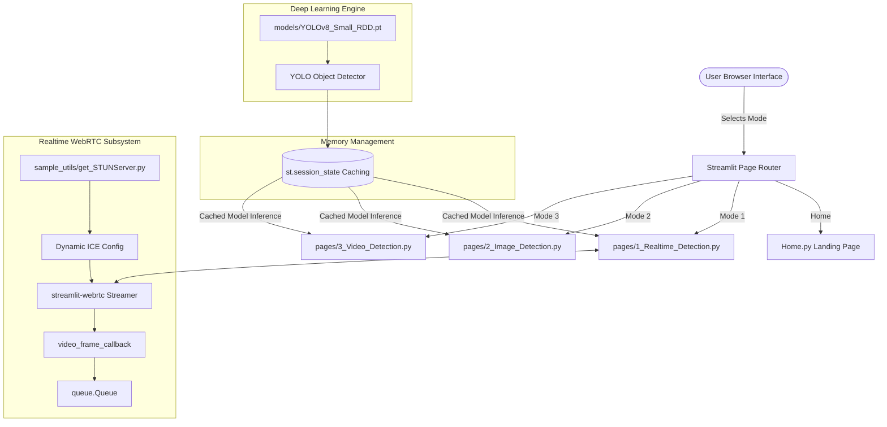

# Complete & Detailed Project Documentation: Road Damage Detection System

---

## Table of Contents
1. [Executive Summary](#1-executive-summary)
2. [Problem Statement & Real-World Context](#2-problem-statement--real-world-context)
   * [2.1 The Challenge of Road Maintenance](#21-the-challenge-of-road-maintenance)
   * [2.2 Traditional vs. AI-Powered Inspection](#22-traditional-vs-ai-powered-inspection)
   * [2.3 Impact and Goal of this Project](#23-impact-and-goal-of-this-project)
   * [2.4 Proposed Solution: Multi-Modal Detection Pipeline](#24-proposed-solution-multi-modal-detection-pipeline)
   * [2.5 State-of-the-Art & Literature Survey](#25-state-of-the-art--literature-survey)
3. [Target Road Damage Types](#3-target-road-damage-types)
4. [Comprehensive Feature Breakdown](#4-comprehensive-feature-breakdown)
5. [How the System Works — Architecture & End-to-End Data Flow](#5-how-the-system-works--architecture--end-to-end-data-flow)
   * [5.1 High-Level Architecture](#51-high-level-architecture)
   * [5.2 Conceptual Explanation of YOLOv8 Object Detection](#52-conceptual-explanation-of-yolov8-object-detection)
   * [5.3 Real-Time Webcam Streaming Flow (WebRTC)](#53-real-time-webcam-streaming-flow-webrtc)
   * [5.4 Image Detection Pipeline](#54-image-detection-pipeline)
   * [5.5 Video Batch Processing Pipeline](#55-video-batch-processing-pipeline)
6. [Dataset & Model Training Pipeline](#6-dataset--model-training-pipeline)
   * [6.1 The CRDDC2022 Dataset](#61-the-crddc2022-dataset)
   * [6.2 Dataset Preprocessing & Bounding Box Normalization](#62-dataset-preprocessing--bounding-box-normalization)
   * [6.3 Background Filtering & Dataset Splitting](#63-background-filtering--dataset-splitting)
   * [6.4 Model Training & Hyperparameters](#64-model-training--hyperparameters)
   * [6.5 Model Evaluation Metrics & Accuracy Results](#65-model-evaluation-metrics--accuracy-results)
7. [Detailed File-by-File Code Breakdown](#7-detailed-file-by-file-code-breakdown)
   * [7.1 `Home.py`](#71-homepy)
   * [7.2 `pages/1_Realtime_Detection.py`](#72-pages1_realtime_detectionpy)
   * [7.3 `pages/2_Image_Detection.py`](#73-pages2_image_detectionpy)
   * [7.4 `pages/3_Video_Detection.py`](#74-pages3_video_detectionpy)
   * [7.5 `sample_utils/get_STUNServer.py`](#75-sample_utilsget_stunserverpy)
   * [7.6 `.streamlit/config.toml`](#76-streamlitconfigtoml)
   * [7.7 Training Notebooks (`0_PrepareDatasetYOLOv8.ipynb`, `1_TrainingYOLOv8.ipynb`, `2_EvaluationTesting.ipynb`)](#77-training-notebooks)
8. [Installation & User Guide](#8-installation--user-guide)
9. [Frequently Asked Questions (FAQ) & Troubleshooting](#9-frequently-asked-questions-faq--troubleshooting)

---

## 1. Executive Summary

The **Road Damage Detection System** is an AI-driven, web-based computer vision application designed to automatically detect, locate, and classify various forms of road surface damage in real time or from pre-recorded media. 

Powered by the state-of-the-art **YOLOv8 (You Only Look Once v8)** deep learning model and built with Python and **Streamlit**, this application transforms standard video feeds (from webcams, dashcams, or recorded footage) into actionable infrastructure maintenance insights.

---

## 2. Problem Statement & Real-World Context

### 2.1 The Challenge of Road Maintenance
Road networks are vital to global transportation, commerce, and public safety. However, roads continuously deteriorate over time due to heavy traffic loads, environmental factors (extreme temperature fluctuations, rainfall, frost heave), and aging materials. Unmanaged defects such as potholes and structural cracks lead to:
* **Severe Traffic Accidents & Vehicle Damage**: Potholes can pop tires, damage wheel rims, break suspensions, or cause drivers to swerve dangerously into oncoming traffic.
* **Astronomical Financial Costs**: Repairing deeply degraded roads costs up to **4 to 5 times more** than early preventive maintenance.
* **Traffic Congestion & Delay**: Unplanned emergency road closures cause massive delays in urban logistics and commuter travel.

### 2.2 Traditional vs. AI-Powered Inspection

| Feature | Traditional Manual Inspection | AI-Powered Road Damage Detection |
| :--- | :--- | :--- |
| **Inspection Method** | Municipal workers driving slowly or walking along roads, taking physical notes or manual photos. | Automated analysis using vehicles equipped with standard smartphones/dashcams or surveillance feeds. |
| **Speed & Scalability** | Extremely slow. Inspecting an entire city network can take months or years. | Real-time / Near-instantaneous. Scans hundreds of kilometers of road daily. |
| **Cost** | High labor costs, vehicle wear and tear, and inspector safety hazards. | Low operational cost using off-the-shelf camera hardware and automated software. |
| **Objectivity** | Subjective. Different inspectors judge crack severity and damage types differently. | Objective & Standardized. The deep learning model evaluates all frames with uniform precision. |
| **Safety** | High risk. Inspectors must step out onto active roads or drive at dangerously slow speeds. | Zero risk to personnel. Cameras collect video while vehicles travel at normal speeds. |

### 2.3 Impact and Goal of this Project
The primary objective of this project is to bridge the gap between **raw video data collection** and **automated municipal decision-making**. By classifying defects into specific types (Longitudinal Cracks, Transverse Cracks, Alligator Cracks, and Potholes), municipal authorities can:
1. **Prioritize repairs** (e.g., immediate pothole patching vs. routine crack sealing).
2. **Automate damage mapping** without requiring manual human data entry.
3. **Extend road lifespan** through early-stage intervention.

### 2.4 Proposed Solution: Multi-Modal Detection Pipeline
To bridge this gap, the **proposed solution** consists of an end-to-end deep learning pipeline that processes different types of input data channels (Image, Video, Webcam) into a unified object detection engine. By providing flexible input options, the application accommodates different real-world municipal and inspector workflows:

1. **📷 Static Image Detection (Diagnostic Spot-Checks)**:
   * **Real-World Use**: Ground inspectors can take a high-resolution snapshot of a specific crack or pothole and upload it for immediate, granular classification.
   * **Outcome**: A side-by-side comparison of the raw image and the annotated bounding box prediction, exportable as a high-resolution PNG for maintenance work orders.
2. **🎥 Offline Video Detection (Batch Auditing & Mapping)**:
   * **Real-World Use**: Municipal vehicles (e.g., garbage trucks, postal vans, street sweepers) mount standard dashcams or smartphones on the windshield to record road conditions during daily routes. The recorded `.mp4` video files are uploaded at the end of a shift.
   * **Outcome**: Frame-by-frame batch inference generates a complete, annotated `.mp4` video file showing all defects and their exact locations, suitable for archiving or review.
3. **📡 Live Webcam Detection (Active Patrol & Instant Alerts)**:
   * **Real-World Use**: Dedicated inspection vehicles drive with a live camera feed active. The application streams frames directly through WebRTC.
   * **Outcome**: Low-latency, real-time predictions display directly on the driver/operator's dashboard, logging defects dynamically in an ongoing tabular format.

### 2.5 State-of-the-Art & Literature Survey

To position this project within the broader academic and industrial landscape, it is helpful to look at how computer vision methodologies have evolved in pavement distress analysis. Below is a summary matrix of critical literature, followed by an in-depth discussion of key improvements:

| Author & Year | Specific Method / Architecture | Dataset & Evaluation | Key Contributions | Major Limitations |
| :--- | :--- | :--- | :--- | :--- |
| **Arya et al. (2022)** | CRDDC Challenge Benchmark | Multi-national benchmark (Japan, India, Czech Rep., China, Norway, USA) | Created standard RDD categories; initiated global cross-country competition. | High computational training cost; domain shift makes generalization difficult. |
| **Arya et al. (2022)** | RDD2022 Dataset Release | 47,420 images, 55,000+ annotations | First large-scale, multi-country public dataset with normalized annotations. | Dataset-specific bias; sensor height and pavement variation limit test performance. |
| **Pham et al. (2022)** | YOLOv7 + Coordinate Attention (CA) + Label Smoothing | RDD2022 & Google Street View data | Dynamic spatial features captured; high F1-score (81.7% US, 74.1% global). | Heavy training footprint; requires high-end GPU resources and anchor tuning. |
| **Jiang (2024)** | Optimized YOLOv8 (DAT, GSConv Neck, MPDIoU Loss) | RDD2022 (Japan / India subset) | Slim-neck design reduces parameter overhead; achieved 65.7% mAP. | Misses hairline cracks and early-stage distress in shadow/low-contrast conditions. |
| **Zeng & Zhong (2024)** | YOLOv8-PD (C2fGhost, BOT, LKSA, LSCD-Head) | RDD2022 & RoadDamage datasets | Highly lightweight model (Params: 74.1%, FLOPs: 74.3%); improved mAP by 1.4%-4.2%. | Architecture complexity from custom heads; slight performance drops on rare classes. |
| **Wang et al. (2024)** | Improved YOLOv8s (C2f-Faster-EMA, SimSPPF, Detect-Dyhead) | Standard Road Damage benchmarks | 5.8% mAP@0.5 increase; model size down by 22.33%; parameters down by 23.03%. | Sensitive to hyperparameter shifts; Detect-Dyhead has higher deployment latency. |
| **RDD-YOLO (2024)** | Enhanced YOLOv8 (SimAM Attention, GhostConv Neck) | RDD2022 Benchmark | Parameter-free attention maps; reduced spatial redundancy in feature routing. | Increased training time to converge; sensitivity to cluttered background elements. |

#### Detailed Discussion:
* **Arya et al. (2022) [RDD2022 / CRDDC Challenge]**: Established the first truly global benchmark with four core damage categories (`D00` longitudinal crack, `D10` transverse crack, `D20` alligator crack, `D40` pothole). Although vital for standardization, the dataset presents high training costs and strong domain shifts across regions (e.g., camera mounting heights and local road material).
* **Pham et al. (2022) [YOLOv7 + Coordinate Attention]**: Added Coordinate Attention (CA) to preserve precise spatial structures of narrow, linear cracks. While yielding high F1-scores, the computational footprint of YOLOv7 remains relatively heavy for low-power edge units.
* **Jiang (2024) [Optimized YOLOv8]**: Utilized Deformable Attention Transformers (DAT) and GSConv to build a slim-neck architecture. This reduced parameter overhead but still struggled under extreme shadow or low-contrast conditions.
* **Zeng & Zhong (2024) [YOLOv8-PD]**: Optimized YOLOv8n (nano) with C2fGhost, Large Separable Kernel Attention (LKSA), and a lightweight shared head (LSCD-Head). They successfully cut parameter counts to 74.1% of baseline, making the model highly suited for mobile devices.
* **Wang et al. (2024) [Improved YOLOv8s]**: Replaced standard components with C2f-Faster-EMA (using partial convolutions) and Detect-Dyhead. This reduced size by 22.33% and boosted mAP by 5.8%, demonstrating that well-designed dynamic heads can optimize parameter utility.
* **RDD-YOLO (2024) [Enhanced YOLOv8]**: Used SimAM parameter-free 3D attention and GhostConv. While enhancing feature extraction, learning dynamic spatial-saliency weights increases training convergence times.

---

## 3. Target Road Damage Types

The deep learning model is trained to recognize 4 major road distress categories defined by international pavement evaluation standards:

```
+-----------------------------------------------------------------------------------+
|                                  ROAD DAMAGE TYPES                                |
+-------------------------+-------------------------+-------------------------------+
| Damage Name             | Dataset Code            | Visual Characteristics & Risk |
+-------------------------+-------------------------+-------------------------------+
| 1. Longitudinal Crack   | D00                     | - Runs parallel to traffic.   |
|                         |                         | - Caused by poor joint seam   |
|                         |                         |   construction or heavy loads.|
+-------------------------+-------------------------+-------------------------------+
| 2. Transverse Crack     | D10                     | - Runs perpendicular to road. |
|                         |                         | - Caused by thermal shrinkage |
|                         |                         |   during cold temperatures.   |
+-------------------------+-------------------------+-------------------------------+
| 3. Alligator Crack      | D20                     | - Pattern resembles alligator |
|                         |                         |   skin or chicken wire.       |
|                         |                         | - Signals structural failure  |
|                         |                         |   of underlying base layer.   |
+-------------------------+-------------------------+-------------------------------+
| 4. Potholes             | D40                     | - Bowl-shaped depressions.    |
|                         |                         | - High immediate safety hazard|
|                         |                         |   to tires and vehicles.      |
+-------------------------+-------------------------+-------------------------------+
```

---

## 4. Comprehensive Feature Breakdown

The application is structured into a multi-page web application with key capabilities:

### 1. 📷 Realtime Webcam Detection
* Connects directly to local webcams or USB video devices via **WebRTC**.
* Processes live incoming frames asynchronously in real time.
* Displays live bounding boxes and labels overlaid on the video stream.
* Features a **Realtime Predictions Table** that displays class names, bounding box coordinates, and confidence scores for every detected defect frame-by-frame.

### 2. 🖼️ Static Image Analysis & Export
* Allows users to upload static image files (`.jpg`, `.png`).
* Displays a **side-by-side comparison**: Raw uploaded image vs. Model predicted image with colored bounding boxes and confidence tags.
* Includes a **Download Prediction Image** button to export the analyzed image to disk in PNG format.

### 3. 🎥 Offline Video Batch Processing
* Accepts pre-recorded MP4 video uploads (e.g., footage captured from dashcams, drones, or smartphones) up to **1GB** in size.
* Reads the video frame-by-frame, performs batch inference, draws annotations, and reconstructs the output video.
* Displays a real-time progress bar showing inference completion percentage ($0\% \rightarrow 100\%$).
* Provides a **Download Prediction Video** button to save the annotated video locally as an `.mp4` file.

### 4. 🎚️ Dynamic Confidence Threshold Tuning
* Includes an interactive slider ($0.0$ to $1.0$, step size $0.05$) on all detection pages.
* Allows users to adjust detection sensitivity on the fly:
  * **Lower threshold** (e.g., $0.25 - 0.35$): Increases sensitivity to detect faint or distant cracks.
  * **Higher threshold** (e.g., $0.60 - 0.75$): Reduces false alarms in noisy or shadowed environments.

### 5. 🌐 Dynamic Geolocation STUN Server Lookup
* Solves WebRTC connection issues across NATs/firewalls by dynamically finding the geographically closest active free STUN server based on the user's latitude and longitude.

---

## 5. How the System Works — Architecture & End-to-End Data Flow

### 5.1 High-Level Architecture



---

### 5.2 Conceptual Explanation of YOLOv8 Object Detection

Unlike traditional two-stage object detectors (like Faster R-CNN) that first generate region proposals and then classify them, **YOLOv8 (You Only Look Once v8)** is a **single-stage neural network**:

1. **Input Frame**: The incoming image (e.g., $1920 \times 1080$) is resized to a standardized square size of **$640 \times 640$ pixels**.
2. **Feature Extraction (Backbone)**: A modified CSPDarknet backbone extracts visual features at multiple scale levels (detecting tiny cracks up to large potholes).
3. **Bounding Box & Class Prediction (Head)**: YOLO divides the image into grid cells. Each cell predicts:
   * **Bounding Box Coordinates** ($x_{center}, y_{center}, \text{width}, \text{height}$).
   * **Objectness Confidence Score** (How confident the model is that an object exists).
   * **Class Probabilities** (Probability distribution across Longitudinal Crack, Transverse Crack, Alligator Crack, and Pothole).
4. **Non-Maximum Suppression (NMS)**: Eliminates redundant overlapping bounding boxes, keeping only the box with the highest confidence score for each defect.
5. **Annotated Overlay**: Bounding boxes, class labels, and confidence percentage tags are drawn over the original image pixels.

---

### 5.3 Real-Time Webcam Streaming Flow (WebRTC)

```
[Webcam Stream] 
       │ (1. Raw Video Frames)
       ▼
[WebRTC Streamer] ──► [sample_utils/get_STUNServer.py] (Fetches nearest STUN server for ICE peer connection)
       │ (2. av.VideoFrame)
       ▼
[video_frame_callback()]
       │ ──► Convert Frame from PyAV to OpenCV BGR NumPy Array
       │ ──► Resize to (640, 640)
       │ ──► Run YOLOv8 Model Inference: net.predict(image, conf=score_threshold)
       │ ──► Put Detections (class, score, box) into queue.Queue
       │ ──► Plot Bounding Boxes: results[0].plot()
       │ ──► Resize back to original frame dimensions (e.g. 1280x720)
       │ ──► Convert back to PyAV av.VideoFrame
       ▼
[WebRTC Streamer Display Window] ──► Render annotated frame to user browser screen
       ▲
       │ (Synchronous Polling)
[Predictions Table UI] ◄── Pulls latest detection list from result_queue.get()
```

---

### 5.4 Image Detection Pipeline

```
1. User uploads PNG/JPG image file via st.file_uploader.
2. PIL.Image loads file into memory -> converted to NumPy RGB Array.
3. Store original dimensions (h_ori, w_ori).
4. Resize array to (640, 640) using cv2.resize.
5. YOLO model performs inference: results = net.predict(image_640, conf=threshold).
6. Draw bounding boxes on image: annotated_frame = results[0].plot().
7. Resize annotated image back to (w_ori, h_ori).
8. Render Column Layout:
   - Column 1: Display Original Input Image.
   - Column 2: Display Prediction Image + Download PNG Button.
```

---

### 5.5 Video Batch Processing Pipeline

```
1. User uploads MP4 video file (up to 1GB).
2. Save raw input BytesIO buffer to disk: ./temp/video_input.mp4.
3. Open input file via OpenCV cv2.VideoCapture.
4. Extract metadata: Width, Height, Frame Rate (FPS), Total Frame Count, Duration.
5. Initialize cv2.VideoWriter with 'mp4v' FourCC codec -> output path ./temp/video_infer.mp4.
6. Initialize Streamlit Progress Bar (0%).
7. Loop while videoCapture.isOpened():
     a. Read next frame (ret, frame).
     b. Convert BGR to RGB color channel.
     c. Resize frame to (640, 640).
     d. Pass frame to net.predict(frame_640, conf=threshold).
     e. Extract bounding boxes and plot annotations: results[0].plot().
     f. Resize annotated frame back to (Original Width, Original Height).
     g. Convert RGB back to BGR and write frame to cv2Writer.
     h. Update live preview image component (imageLocation.image).
     i. Update progress bar percentage: (_frame_counter / _frame_count).
8. Release cv2.VideoCapture and cv2.VideoWriter file locks.
9. Present Download Prediction Video button (st.download_button) to save result MP4 file.
```

---

## 6. Dataset & Model Training Pipeline

### 6.1 The CRDDC2022 Dataset
The model was trained on data from the **Crowdsensing-based Road Damage Detection Challenge 2022 (CRDDC2022)**. 

While the full challenge dataset spans multiple countries (Japan, India, China, Czech Republic, Norway, United States), this project specifically utilizes the **Japan** and **India** datasets to build a balanced, generalized detector capable of handling both well-maintained highways (Japan) and complex urban/rural road conditions (India).

---

### 6.2 Dataset Preprocessing & Bounding Box Normalization

The raw dataset provides annotations in **PascalVOC XML** format with absolute pixel values ($x_{min}, y_{min}, x_{max}, y_{max}$). YOLOv8 requires annotations in **YOLO TXT** format normalized between $0.0$ and $1.0$.

#### Conversion Algorithm (`convertPascal2YOLOv8` in `0_PrepareDatasetYOLOv8.ipynb`):

$$\text{width}_{norm} = \frac{x_{max} - x_{min}}{\text{Image Width}}$$

$$\text{height}_{norm} = \frac{y_{max} - y_{min}}{\text{Image Height}}$$

$$\text{center\_x}_{norm} = \frac{x_{min} + \left(\frac{x_{max} - x_{min}}{2}\right)}{\text{Image Width}}$$

$$\text{center\_y}_{norm} = \frac{y_{min} + \left(\frac{y_{max} - y_{min}}{2}\right)}{\text{Image Height}}$$

#### PascalVOC Class to YOLO Index Mapping:
* `D00` $\rightarrow$ Class `0` (Longitudinal Crack)
* `D10` $\rightarrow$ Class `1` (Transverse Crack)
* `D20` $\rightarrow$ Class `2` (Alligator Crack)
* `D40` $\rightarrow$ Class `3` (Potholes)
* *Unused classes (`D01`, `D11`, `D43`, `D44`, `D50`) are ignored and excluded during parsing.*

---

### 6.3 Background Filtering & Dataset Splitting

To ensure the neural network does not produce high false-positive rates on undamaged road surfaces:
1. **Background Image Cap**: Images containing no damage annotations (pure background images) are capped at **10%** of total dataset size (`backgroundImages_Percentage = 0.1`).
2. **Train/Val Split**: Split ratio of **90% Training / 10% Validation**, using random seed `1337`.

#### Final Dataset Partitioning:
* **Japan**: 8,055 Training Images | 895 Validation Images
* **India**: 3,594 Training Images | 399 Validation Images
* **Total Training Set**: **11,649 Images**
* **Total Validation Set**: **1,294 Images**

---

### 6.4 Model Training & Hyperparameters

Training executed using `1_TrainingYOLOv8.ipynb`:

```python
model = YOLO('yolov8s.pt') # Start from pre-trained COCO YOLOv8 Small weights
results = model.train(
    data="rdd_JapanIndia.yaml",
    epochs=100,
    warmup_epochs=5,
    batch=32,
    imgsz=640,
    save_period=10,
    workers=1,
    project="runs/RDD_JapanIndia",
    name="Baseline_YOLOv8Small_Filtered",
    seed=1337,
    cos_lr=True, # Cosine learning rate scheduler
    mosaic=0.0   # Disabled mosaic to preserve original road geometry
)
```

---

### 6.5 Model Evaluation Metrics & Accuracy Results

Evaluated using `2_EvaluationTesting.ipynb` on an NVIDIA GeForce RTX 2060 GPU across 1,294 validation images (2,272 defect instances):

```
+-----------------------------------------------------------------------------------+
|                            VAL EVALUATION PERFORMANCE                             |
+---------------------+------------+-----------+-----------+----------+-------------+
| Damage Category     | Instances  | Precision | Recall    | mAP@50   | mAP@50-95   |
+---------------------+------------+-----------+-----------+----------+-------------+
| ALL CLASSES         | 2,272      | 0.584     | 0.523     | 0.547    | 0.254       |
| Longitudinal Crack  | 555        | 0.573     | 0.471     | 0.501    | 0.235       |
| Transverse Crack    | 371        | 0.522     | 0.433     | 0.454    | 0.177       |
| Alligator Crack     | 848        | 0.659     | 0.684     | 0.709    | 0.373       |
| Potholes            | 498        | 0.584     | 0.503     | 0.524    | 0.229       |
+---------------------+------------+-----------+-----------+----------+-------------+
```

* **Speed Metrics**: **0.7 ms** preprocessing, **9.3 ms** inference, **3.4 ms** postprocessing per image.

---

## 7. Detailed File-by-File Code Breakdown

### 7.1 `Home.py`
The landing page and root entrypoint for the Streamlit application.
* `st.set_page_config(...)`: Sets browser tab title to "RoadShield - Road Damage Detection" and icon to `🛣️`.
* `inject_base_css()` (from `sample_utils/ui.py`): Injects the shared dark-glass theme, fonts, and component styles used across all pages.
* `render_hero(...)`: Renders the hero banner with badge, title, and description.
* Three `st.columns` feature cards linking the concept of Realtime, Image, and Video detection modes.
* `render_class_legend()`: Renders the damage-type color legend (Longitudinal/Transverse/Alligator Crack, Potholes).
* An `st.expander("About this project")` with dataset/model attribution, followed by `render_footer()`.

---

### 7.2 `pages/1_Realtime_Detection.py`
Handles live webcam streaming and real-time bounding box rendering.

#### Key Code Components:
* **Model Loading & Session State Caching**:
  ```python
  cache_key = "yolov8smallrdd"
  if cache_key in st.session_state:
      net = st.session_state[cache_key]
  else:
      net = YOLO(MODEL_LOCAL_PATH)
      st.session_state[cache_key] = net
  ```
  *Prevents re-instantiating the PyTorch model object during Streamlit reruns.*

* **Thread-Safe Results Queue**:
  ```python
  result_queue: "queue.Queue[List[Detection]]" = queue.Queue()
  ```
  *Transfers prediction outputs from the background WebRTC processing thread to the main Streamlit UI thread.*

* **Frame Callback Function (`video_frame_callback`)**:
  Receives `av.VideoFrame`, converts frame to BGR NumPy array, resizes to $640 \times 640$, calls `net.predict(..., conf=score_threshold)`, pushes detected bounding box tuples to `result_queue`, draws annotated boxes using `results[0].plot()`, and converts frame back to PyAV `av.VideoFrame`.

* **WebRTC Component (`webrtc_streamer`)**:
  Sets mode to `SENDRECV`, injects dynamic STUN server ICE configuration, links `video_frame_callback`, and enforces video width constraints.

---

### 7.3 `pages/2_Image_Detection.py`
Handles static image file upload and prediction download.

#### Key Code Components:
* `st.file_uploader("Upload Image", type=['png', 'jpg'])`: File picker UI element.
* `Image.open(image_file)`: Reads image stream via PIL.
* `net.predict(image_resized, conf=score_threshold)`: Runs YOLO inference.
* `st.columns(2)`: Splits screen into 2 side-by-side columns (Left: Raw image, Right: Predictions).
* `st.download_button(...)`: Saves prediction image into an in-memory PNG buffer (`io.BytesIO`) and serves it for user download.

---

### 7.4 `pages/3_Video_Detection.py`
Handles offline video file processing frame-by-frame.

#### Key Code Components:
* `write_bytesio_to_file(temp_file_input, video_file)`: Writes uploaded video stream to disk (`./temp/video_input.mp4`).
* `cv2.VideoCapture(temp_file_input)`: Opens input video stream and extracts metadata (`_width`, `_height`, `_fps`, `_frame_count`).
* `cv2.VideoWriter(temp_file_infer, fourcc_mp4, _fps, (_width, _height))`: Initializes output video encoder using `'mp4v'` FourCC codec.
* **Frame Loop**: Loops over frames, executes YOLO prediction, writes annotated frame to disk via `cv2writer.write(_out_frame)`, updates live preview image container (`imageLocation`), and updates `st.progress` bar.
* `st.download_button(...)`: Exposes completed `./temp/video_infer.mp4` video for single-click browser download.

---

### 7.5 `sample_utils/get_STUNServer.py`
Dynamic STUN server location utility for WebRTC.

#### How It Works:
1. Queries `https://raw.githubusercontent.com/pradt2/always-online-stun/master/geoip_cache.txt` for active STUN servers and their geographical coordinates.
2. Queries `https://geolocation-db.com/json` to get current client Latitude & Longitude.
3. Queries `valid_ipv4s.txt` for active IP address lists.
4. Computes Euclidean distance between user location and each STUN server location:
   $$\text{Distance} = \sqrt{(\text{Lat}_{user} - \text{Lat}_{stun})^2 + (\text{Lon}_{user} - \text{Lon}_{stun})^2}$$
5. Returns the nearest `IP:PORT` string to guarantee low-latency NAT traversal.

---

### 7.6 `.streamlit/config.toml`
Streamlit server configuration file:
```toml
[server]
maxUploadSize = 1000 # Allows uploading video files up to 1000 Megabytes (1GB)

[theme]
base = "dark" # Enforces the dark glass theme used by sample_utils/ui.py
```

---

### 7.7 Training Notebooks
1. **`0_PrepareDatasetYOLOv8.ipynb`**: Data conversion from PascalVOC XML to YOLO TXT format, background image filtering, and creation of `rddJapanIndiaFiltered` folder structure.
2. **`1_TrainingYOLOv8.ipynb`**: Training execution script with hyperparameter definitions and training resumption capabilities (`resume=True`).
3. **`2_EvaluationTesting.ipynb`**: Validation execution script generating metrics (Precision, Recall, mAP50, mAP50-95) and saving evaluation plots to `runs/detect/val`.

---

## 8. Installation & User Guide

See `README.md` for the up-to-date, step-by-step local setup instructions (using `uv`, Python 3.10/3.11, and the CUDA/CPU `torch` install choice). The short version:

```bash
# From the RoadShield/ project root
uv venv --python 3.10 .venv
source .venv/bin/activate        # on Windows: .venv\Scripts\activate

# Pick ONE: CUDA build (NVIDIA GPU) or CPU-only build
uv pip install torch torchvision --index-url https://download.pytorch.org/whl/cu121
# uv pip install torch torchvision   # CPU-only

uv pip install -r requirements.txt

streamlit run Home.py
```
Open your browser and navigate to `http://localhost:8501`.

---

## 9. Frequently Asked Questions (FAQ) & Troubleshooting

#### Q1: Why is my webcam not displaying in Realtime Detection?
* **Answer**: Ensure your browser has granted camera access permissions. If running remotely or inside Docker/WSL, WebRTC requires valid STUN/TURN server connectivity. Verify that outbound UDP connections are not blocked by a local firewall.

#### Q2: Why does processing long videos take a few minutes?
* **Answer**: Video detection runs model inference individually on **every single frame** of the video (e.g., a 1-minute video at 30 FPS requires 1,800 separate YOLO model predictions). Using a CUDA-enabled GPU significantly accelerates processing.

#### Q3: How do I reduce false positive detections (e.g., shadows misclassified as cracks)?
* **Answer**: Increase the **Confidence Threshold** slider on the left sidebar from `0.50` to `0.65` or `0.70`.

#### Q4: How can I retrain the model on my own local road dataset?
* **Answer**: Convert your dataset to YOLOv8 format using `0_PrepareDatasetYOLOv8.ipynb`, update `training/dataset/rddJapanIndiaFiltered/rdd_JapanIndia.yaml` with your file paths, and execute `1_TrainingYOLOv8.ipynb`.
