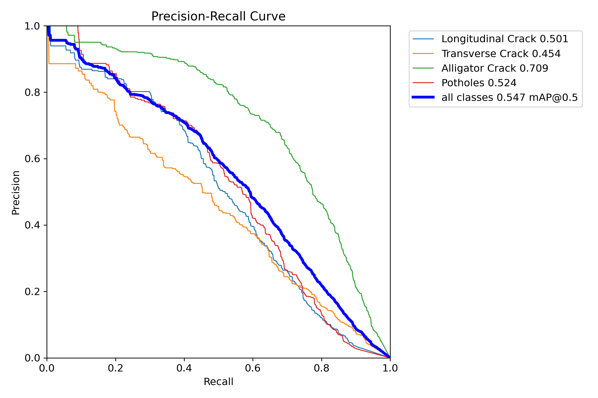
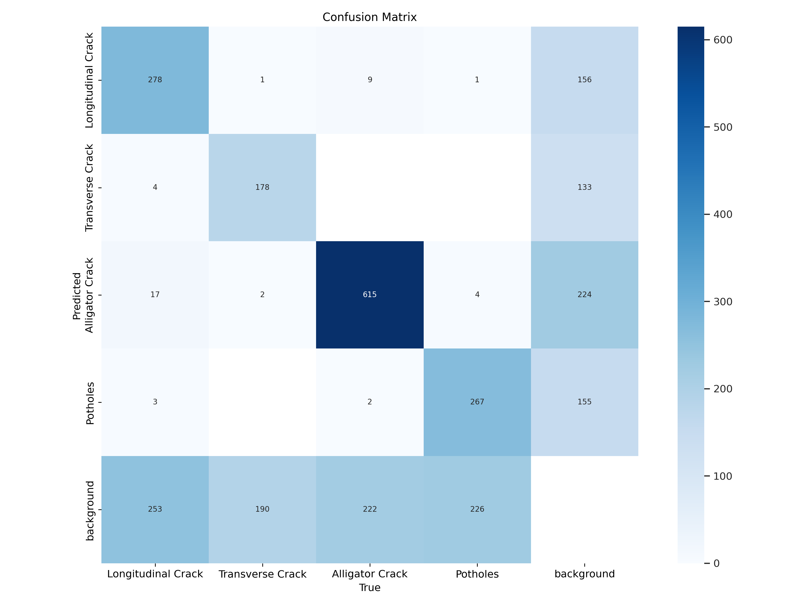
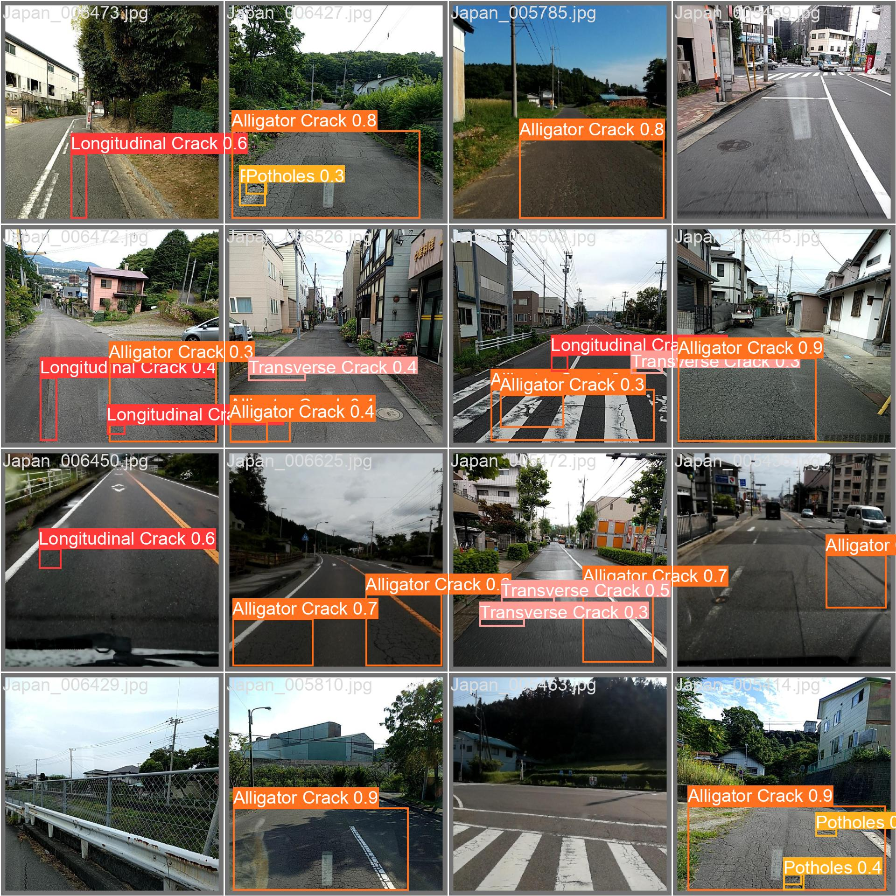

# Road Damage Detection Applications

This project is road damage detection applications that designed to enhance road safety and infrastructure maintenance by swiftly identifying and categorizing various forms of road damage, such as potholes and cracks.

## Screenshots

<!-- TODO: add updated screenshots of the current UI here, e.g.:


-->


The project is powered by YOLOv8 deep learning model that trained on Crowdsensing-based Road Damage Detection Challenge 2022 dataset.

There is four types of damage that this model can detects such as:
- Longitudinal Crack
- Transverse Crack
- Alligator Crack
- Potholes

## Running on Local Server

This is the step that you take to install and run the web-application on the local server.

Requires Python 3.10 or 3.11 (the pinned versions in `requirements.txt` are unpinned to stay portable across teammates' machines/OSes, but very new or very old Python versions may still break `torch`/`opencv`).

``` bash
# Using uv (recommended, works cross-platform without needing conda)
uv venv --python 3.10 .venv
source .venv/bin/activate        # on Windows: .venv\Scripts\activate

# If you have an NVIDIA GPU and want CUDA acceleration:
uv pip install torch torchvision --index-url https://download.pytorch.org/whl/cu121
# If you don't have an NVIDIA GPU (CPU-only):
# uv pip install torch torchvision

# Install the rest of the requirements
uv pip install -r requirements.txt

# On Linux, you may also need system OpenGL libs for OpenCV:
# sudo apt install libgl1 libgl1-mesa-glx

# Start the streamlit webserver
streamlit run Home.py
```

<details>
<summary>Without uv (plain venv + pip)</summary>

``` bash
python3.10 -m venv .venv
source .venv/bin/activate        # on Windows: .venv\Scripts\activate

pip install torch torchvision --index-url https://download.pytorch.org/whl/cu121   # or CPU-only, see above
pip install -r requirements.txt

streamlit run Home.py
```
</details>

## Training

### Prepare the Dataset

Download the datasets from Crowdsensing-based Road Damage Detection Challenge (CRDDC2022) and extract the *RDD2022.zip* files into the dataset folder structure.

Perform the dataset conversion from PascalVOC to YOLOv8 format using **0_PrepareDatasetYOLOv8.ipnb** notebook. This will also create a train and val split for the dataset due to lack of test labels on the original dataset. It will also remove excess background image from the dataset. It will copy the dataset and create a new directory on the training folder.

```
├── dataset
│   └── rddJapanIndiaFiltered
│       ├── India
│       │   ├── images
│       │   │   ├── train
│       │   │   └── val
│       │   └── labels
│       │       ├── train
│       │       └── val
│       ├── Japan
│       │   └── ...
│       └── rdd_JapanIndia.yaml # Create this file for YOLO dataset config
└── runs
```

Run the training on **1_TrainingYOLOv8.ipynb** notebook. You can change the hyperparamter and training configuration on that notebook.

## Evaluation Result

This is the training result of the YOLOv8s model that trained on the filtered Japan and India dataset with RTX2060 GPU. You can perform the evaluation on your dataset with **2_EvaluationTesting.ipynb** notebook, just convert your dataset into ultralytics format.

<p align="center">
    
    
    
</p>

## License and Citations
- Road Damage Dataset from Crowdsensing-based Road Damage Detection Challenge (CRDDC2022)
- YOLOv8 by Ultralytics